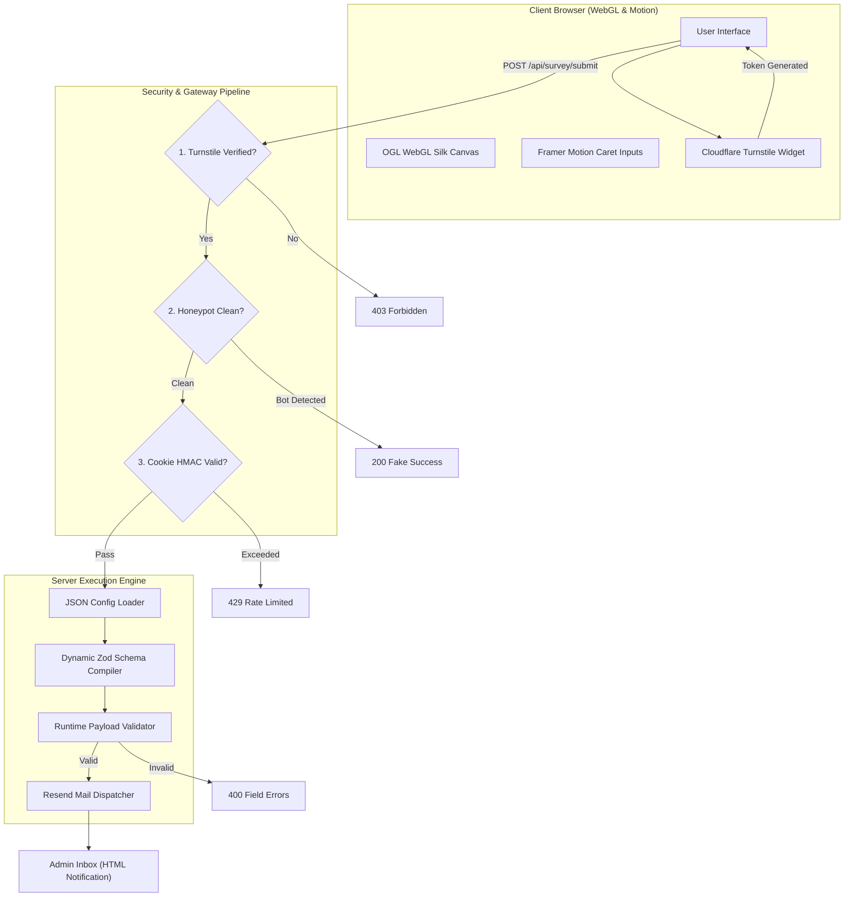
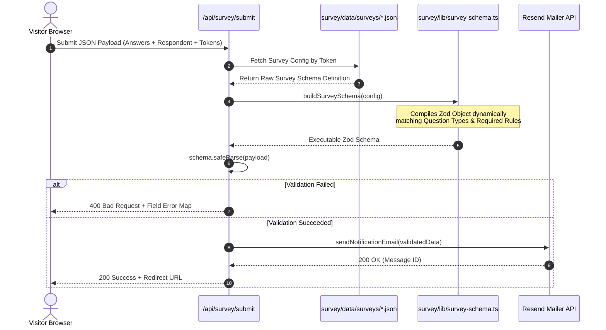

# Isolated Client Survey System


A lightweight Next.js 14 survey engine designed for client onboarding and project completion workflows. It runs without a database, parsing declarative JSON files into dynamic validation schemas and delivering responses over email.

---

## System Architecture



---

## Data Pipeline & Schema Compilation



---

## Technical Features

> [!NOTE]
> All visual assets, shaders, and micro-interactions run on the client's GPU via WebGL, keeping server-side CPU consumption near zero.

### 1. Declarative JSON Survey Configuration
Surveys are written as plain JSON definitions. The server reads the file on demand and compiles a Zod validation schema matching question types and requirements.

### 2. Multi-Layer Security
- **Cloudflare Turnstile:** Submission buttons are disabled until the client challenge resolves.
- **Honeypot Traps:** Silent failure routing traps malicious automated submitters.
- **Signed Cookie Rate Limiting:** HMAC-signed cookies prevent rapid repeated POST requests.

### 3. Theme-Aware WebGL Shader
Background rendering uses custom satin silk shaders via OGL. A MutationObserver detects document root class changes, switching shader color palettes dynamically between light mode (`#ECEAE4`) and dark mode (`#36323B`).

### 4. Zero Database Requirement
Responses compile into styled HTML emails delivered via Resend. In development mode without API keys, payloads output directly to `stdout`.

---

## Stack Specifications

| Layer | Library / Engine | Technical Role |
| :--- | :--- | :--- |
| **Core** | Next.js 14.2 (App Router) | React Server Components, Server Actions |
| **Language** | TypeScript 5.8 | Strict type assertions across JSON & runtime APIs |
| **Styling** | Tailwind CSS v4 | CSS variable design tokens and utility rules |
| **Graphics** | OGL 1.0 | Low-overhead WebGL shader pipeline |
| **Motion** | Framer Motion 12 | Caret position spring physics |
| **Validation** | Zod 3.23 | Dynamic runtime schema synthesis |
| **Email** | Resend 4.0 | Direct HTML mail dispatch |
| **Bot Gate** | React Turnstile | Cloudflare Turnstile token validation |

---

## Performance and Resource Footprint

```
Memory Allocation (RAM):
  [====================                        ] 70 MB (Idle)
  [============================                ] 110 MB (Active Submit)

CPU Load (1 vCPU Core):
  [=                                           ] <1% (Idle)
  [===                                         ] <5% (Spike during POST parsing)
```

---

## Project Structure

```
.
├── app/                           # Next.js App Router entry points
│   ├── layout.tsx                 # Root layout, Google fonts, theme init script
│   ├── globals.css                # Tailwind imports and CSS token definitions
│   ├── (survey)/                  # Route group sharing the survey shell
│   │   ├── layout.tsx             # Shell wrapper with floating controls
│   │   ├── [slug]/page.tsx        # Dynamic survey page loader
│   │   └── thank-you/page.tsx     # Submission confirmation page
│   ├── not-found.tsx              # Clean 404 page
│   └── api/
│       └── survey/submit/route.ts # Verification and mail submission route
├── survey/                        # Core domain logic
│   ├── data/surveys/              # JSON survey configs (onboarding, completion)
│   ├── components/                # UI components, question types, WebGL canvas
│   ├── i18n/                      # Turkish / English translation dictionaries
│   ├── lib/                       # Zod schema builder, rate limiter, mailer
│   └── styles/                    # Tokens and color definitions
└── README.md
```

---

## Setup and Development

### Prerequisites
- Node.js `18.17.0` or higher
- pnpm `9.0.0` or higher

### Environment Configuration
Create `.env.local` in the project root:

```env
# Mail Delivery
RESEND_API_KEY=re_your_resend_api_key
RESEND_FROM_EMAIL=surveys@yourdomain.com
NOTIFICATION_TO_EMAIL=admin@yourdomain.com

# Cloudflare Turnstile
NEXT_PUBLIC_TURNSTILE_SITE_KEY=1x00000000000000000000AA
TURNSTILE_SECRET_KEY=1x0000000000000000000000000000000AA
```

### Installation & Commands

```bash
# Install dependencies
pnpm install

# Start development server
pnpm dev

# Build for production
pnpm build
pnpm start
```

Default local routes:
- Onboarding Survey: `http://localhost:3000/client-onboarding`
- Completion Survey: `http://localhost:3000/project-completion`

---

## License

This project is licensed under the MIT License.
